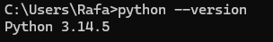
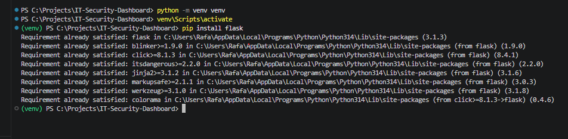
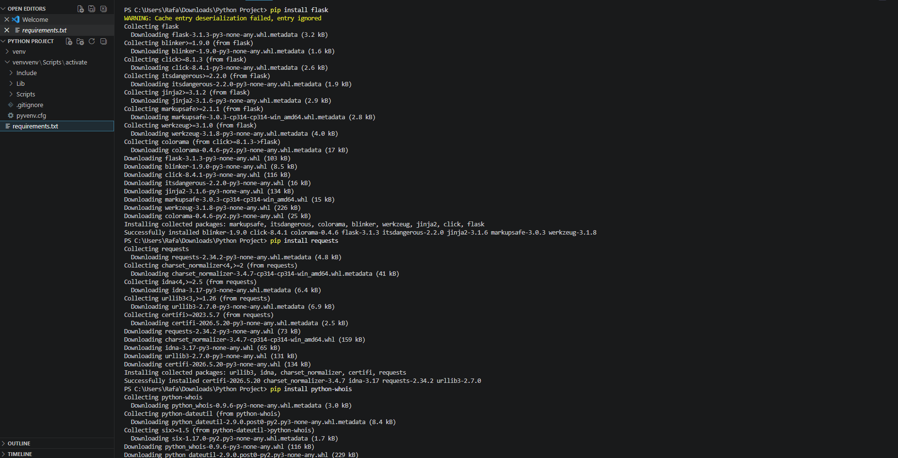
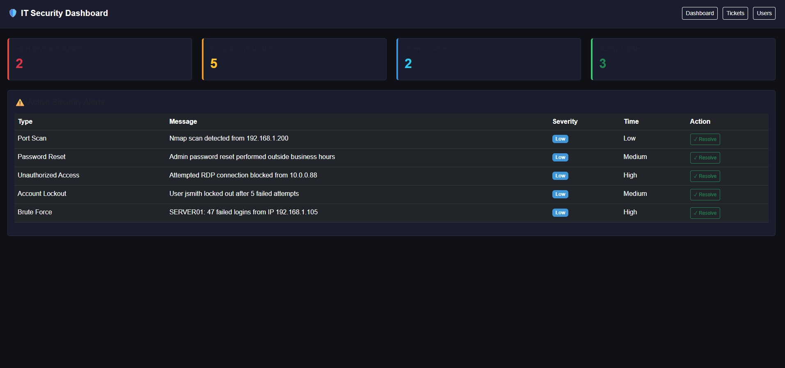
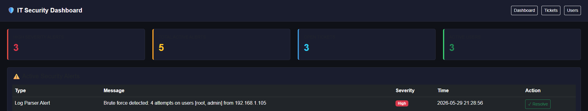
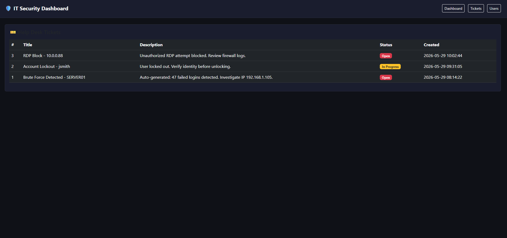

# IT Security Dashboard

A Flask-based internal IT security monitoring portal built to simulate real enterprise security operations. Built to demonstrate SOC analyst workflows including log parsing, automated alerting, and incident ticketing.

## Features
- Real-time security alert dashboard
- Brute force detection via log parsing
- Auto-generated help desk tickets from security events
- Active Directory locked account reporting
- User management panel
- Dockerfile included for containerization

## Tech Stack
- Python / Flask
- SQLite
- Bootstrap 5
- Docker

## Screenshots

### Environment Setup — Python version confirmed and Flask installed




### Dashboard — Live security alerts with severity badges


### Log Parser — Auto-generated alerts from parsed auth logs


### Tickets — Auto-generated ticket from log parser brute force detection


### Tickets Dashboard


## How To Run Locally

```bash
git clone https://github.com/YOURUSERNAME/IT-Security-Dashboard
cd IT-Security-Dashboard
python -m venv venv
venv\Scripts\activate
pip install flask
python app.py
```

Open http://localhost:5000

## How The Log Parser Works

```bash
python log_parser.py
```

Refresh the dashboard to see auto-generated alerts and tickets from parsed auth logs. This simulates the same detection logic used in real SOC environments and intrusion detection systems.

## Project Structure
